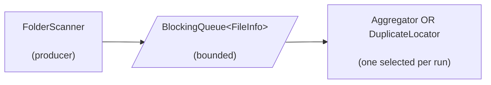

# folder-scanner

A CLI utility that walks a directory tree in parallel and feeds every file to a pluggable consumer.
The producer (scanner) and the consumer run on separate thread pools
connected by a bounded queue — when the queue fills, the producer blocks, so
heap stays flat regardless of tree size. Two consumers are currently available:

- `aggregate` — counts and bytes per extension, size bucket, and date bucket.
- `duplicates` — finds identical-content files and writes a shell script that
  quarantines them (or, with `--hard-delete`, removes them outright).



The scanner (producer) is agnostic of which consumer it feeds. Exactly one consumer
runs per invocation (selected by `--consumer`); the chosen one picks its own
`FileInfo` variant and its drainer count (consumer threads). Per-consumer pipeline
details live in their source files.

## Quick start

Requires Java 21 and Maven on PATH.

```bash
./scripts/start.sh --build                                                 # one-time: mvn clean package
./scripts/start.sh --exclude=.git,target                                   # aggregates the current folder
./scripts/start.sh --consumer=duplicates --exclude=.git,target /mnt/c      # locates duplicates in /mnt/c
./scripts/start.sh --help                                                  # all flags
```

**Producer-side filters**

`--exclude=LIST`, `--min-size=SIZE`, and `--file-extensions=LIST` are producer-side filters — filtered-out entries
never enter the bounded queue. `--exclude` is the cheapest because it short-circuits whole subtrees before any
directory listing; the other two cost one attribute check per file.

**Recommended exclude list** for `/mnt/c` (WSL → Windows drive)

```bash
./scripts/start.sh --consumer=duplicates --min-size=1MB --hard-delete \
  --exclude="Windows,ProgramData,Program Files,Program Files (x86),\$Recycle.Bin,System Volume Information,\
workspaceStorage,extensions,.idea,\
.git,node_modules,target,.mvn,build,dist,.gradle,bin,\
EBWebView,WebviewCacheX64,webview2_user_data,cef_cache,WidevineCdm,component_crx_cache,\
AmazonQ,puppeteer,.nuget" \
  /mnt/c
```

**Runtime knobs**

`scripts/start.sh --help` lists every flag. The producer pool defaults higher than the consumer pool because
directory walking is IO-bound — extra producer threads stay productive while others wait on the disk.
To retune for a specific tree, run `./scripts/benchmarks.sh --combinations` (or `--combinations-q` to sweep queue
implementations too) — it walks a grid of producer/consumer/queue configurations and prints throughput for each.
