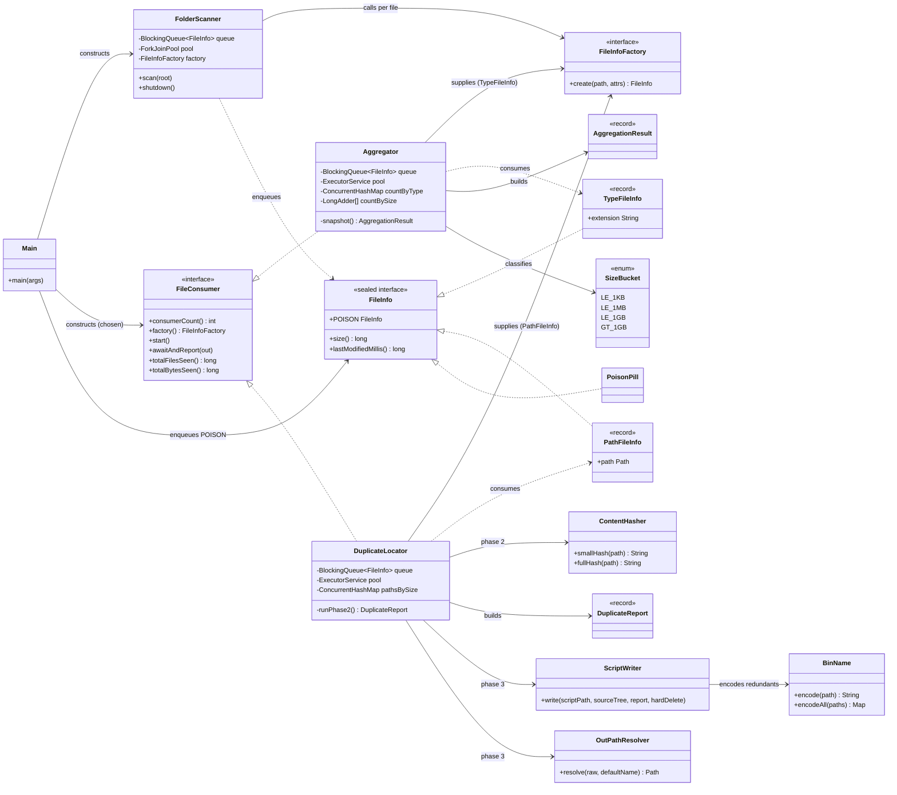
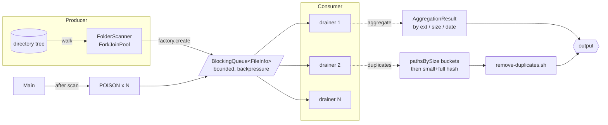

# folder-scanner

Parallel filesystem walker with pluggable consumers. The producer is a pool
of scanner threads walking the directory tree, and the consumer is a pool
of drainer threads doing the per-file work — the two sides run concurrently
on different cores and meet at a single bounded queue. Two consumers ship
today:

- `aggregate` — counts and bytes per extension, size bucket, and date bucket.
- `duplicates` — finds files with identical content (by size pre-filter then
  progressive SHA-256) and emits a shell script that quarantines or deletes
  the redundant copies.

The split keeps the scanner agnostic of what the consumer does; the consumer
chooses what shape of message it needs and how many drainer threads to run.

---

## Quick start

```bash
./scripts/start.sh --build                                              # one-time: mvn clean package
./scripts/start.sh --exclude=.git,target ../..                          # aggregate the parent project
./scripts/start.sh --consumer=duplicates --exclude=.git,target /path    # write ./remove-duplicates.sh
./scripts/start.sh --help                                               # all flags
```

`--exclude` is required (the producer skips these directory basenames at the walk level); an empty list would walk `.git` ref files and per-app caches that the duplicate finder should never touch.

Requires Java 21 and Maven on PATH.

### Recommended sample for `/mnt/c` (WSL → Windows drive)

```bash
./scripts/start.sh --consumer=duplicates --min-size=1MB --hard-delete \
  --exclude="Windows,ProgramData,Program Files,Program Files (x86),\$Recycle.Bin,System Volume Information,\
workspaceStorage,extensions,.idea,\
.git,node_modules,target,.mvn,build,dist,.gradle,bin,\
EBWebView,WebviewCacheX64,webview2_user_data,cef_cache,WidevineCdm,component_crx_cache,\
AmazonQ,puppeteer,.nuget" \
  /mnt/c
```

Each line of the `--exclude` value maps 1-to-1 with the bullets below; the trailing `\` inside the quoted string is bash line-continuation, so the value is still a single comma-separated argument.

Why each group is excluded (ordered OS → IDE → application):

- **OS — Windows system trees** (`Windows`, `ProgramData`, `Program Files`, `Program Files (x86)`, `$Recycle.Bin`, `System Volume Information`) — `TrustedInstaller`-owned and/or NTFS-hardlinked, so "deleting" frees no disk and risks breaking the OS. For WinSxS bloat use `dism /Online /Cleanup-Image /StartComponentCleanup` instead of this tool.
- **IDE — per-IDE / per-workspace state** (`workspaceStorage`, `extensions`, `.idea`) — each IDE (Code, Cursor, Windsurf, JetBrains) and each workspace expects its own copy of extensions, Eclipse JDT indexes, and project metadata in place.
- **Application — `.git` and build outputs** (`.git`, `node_modules`, `target`, `.mvn`, `build`, `dist`, `.gradle`, `bin`) — build outputs are trivially regenerable, but their "duplicates" are usually two copies of the same dependency at different versions and deleting either one breaks the build; `.git` ref files (`refs/heads/*`, `ORIG_HEAD`, packed-refs) are byte-identical right after a sync and quarantining any of them corrupts the repo.
- **Application — per-app webview / DRM caches** (`EBWebView`, `WebviewCacheX64`, `webview2_user_data`, `cef_cache`, `WidevineCdm`, `component_crx_cache`) — each app (Edge, Acrobat, DBeaver, DriveFS, OBS, Zoom, WhatsApp, MSTeams, Search) keeps its own private copy of Chromium / Widevine / WebView2 shared components; cross-app deletes silently break the losing app until it re-hydrates.
- **Application — versioned installs / package caches** (`AmazonQ`, `puppeteer`, `.nuget`) — the "duplicates" are actually different versions, not redundant copies.

Versioned trees the scanner can't catch by basename alone (e.g. `Premiere Pro/23.0` vs `24.0`, `aws/toolkits/.../1.48.0` vs `1.49.0`) still need a manual review of `remove-duplicates.sh` before you run it.

---

## Architecture

Three packages, one composition root:

```
com.example.folderscanner
├── Main                  composition root: wires producer + consumer + queue
├── producer/
│   ├── FolderScanner     the producer; walks the tree, calls factory()
│   └── FileInfoFactory   SPI: consumer-supplied, so producer stays generic
├── consumer/
│   ├── FileConsumer      SPI: every consumer plugs in through this interface
│   ├── Aggregator        consumer #1
│   └── DuplicateLocator  consumer #2
└── data/
    ├── FileInfo          sealed message interface; POISON sentinel
    ├── TypeFileInfo      variant for the aggregate path
    └── PathFileInfo      variant for the duplicates path
```

### Why this shape

- **Bounded queue** between scanner and drainers = backpressure / OOM defense.
- **`ForkJoinPool`** on the producer side = work-stealing across uneven subtrees.
- **`FileConsumer` SPI + consumer-supplied `FileInfoFactory`** = scanner stays generic; each consumer picks its own message variant. `FileInfo` is `sealed`.
- **`POISON` sentinel** (one per drainer) = clean shutdown without a flag or interrupt.
- **DuplicateLocator runs in two phases.** Phase 1 (live with the scan): bucket by size; unique sizes can't be duplicates and are dropped. Phase 2: small-hash (first 4 KB) splits, then full-hash on survivors. Phase 2 has its own `ForkJoinPool`.

---

## Class diagram



---

## Data flow



Backpressure: when the queue is full, `FolderScanner` workers block on
`queue.put()`. Heap stays flat rather than climbing with the file count.

---

## Runtime knobs

`scripts/start.sh --help` lists every flag and its default. The defaults for
`--producers` / `--consumers` are reasonable starting points but are not
universally optimal — the best split depends on whether your workload is
IO-bound (large tree on a slow disk) or CPU-bound (hashing many small files
on a fast SSD), and on the queue type. To retune for your specific tree,
run `./scripts/start.sh --combinations` (or `--combinations-q` to also sweep queue
implementations); it walks a grid of producer/consumer/queue configurations
and prints the throughput for each.
